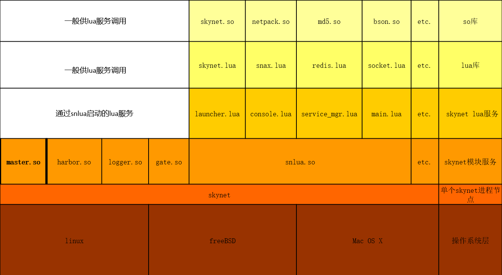

# skynet学习笔记


```
Something I hope you know before go into the coding~
* First, please watch or star this repo, I'll be more happy if you follow me.
* Bug report, questions and discussion are welcome, you can post an issue or pull a request.
```

## 简述

**skynet是什么？**

- skynet是框架，轻量级服务端底层管理框架
- 云风（某位留着长头发的瓜娃子）编写的服务端底层管理框架，底层核心由C编写，配套lua作为脚本使用，可更换为其他任意语种，作者偏爱lua。


**skynet能干啥？**

- 客户端角度：（全球人口总数）亿万人CRUD一个或N个变量
- 服务端角度：管理亿万个小弟吃喝拉撒、掌握生死、资产分配

**skynet架构？**

* 分层架构


## 目录

* [skynet基本概念](docs/skynet基本概念.md)
    * [游戏服务器架构通识](docs/skynet基本概念/游戏服务器架构通识.md)
    * [源码目录结构](docs/skynet基本概念/源码目录结构.md)
* [skynet基本使用](docs/skynet基本使用.md)
    * [源码获取及编译](docs/skynet基本使用/源码获取及编译.md)
    * [helloworld](docs/skynet基本使用/helloworld.md)


## 分层架构




## 参考

* <https://blog.codingnow.com/2012/09/the_design_of_skynet.html>
* <https://manistein.github.io/blog/post/server/skynet/skynet%E6%BA%90%E7%A0%81%E8%B5%8F%E6%9E%90/>
* <http://forthxu.com/blog/skynet.html> （切记不要看评论!!切记切记!!）
