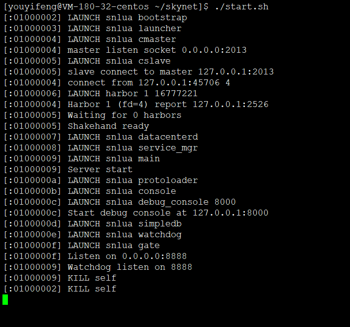
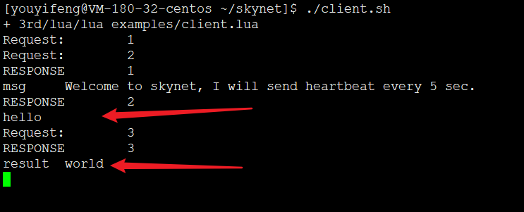
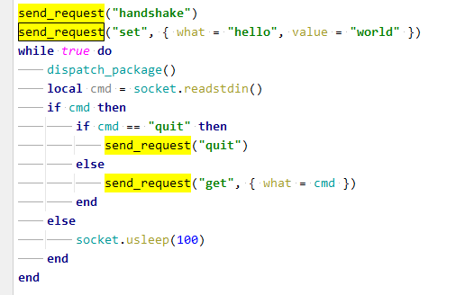
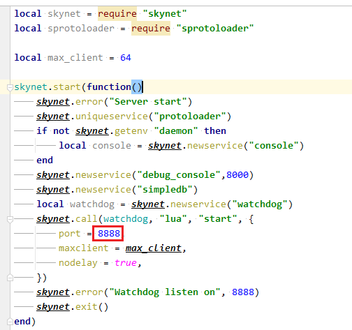
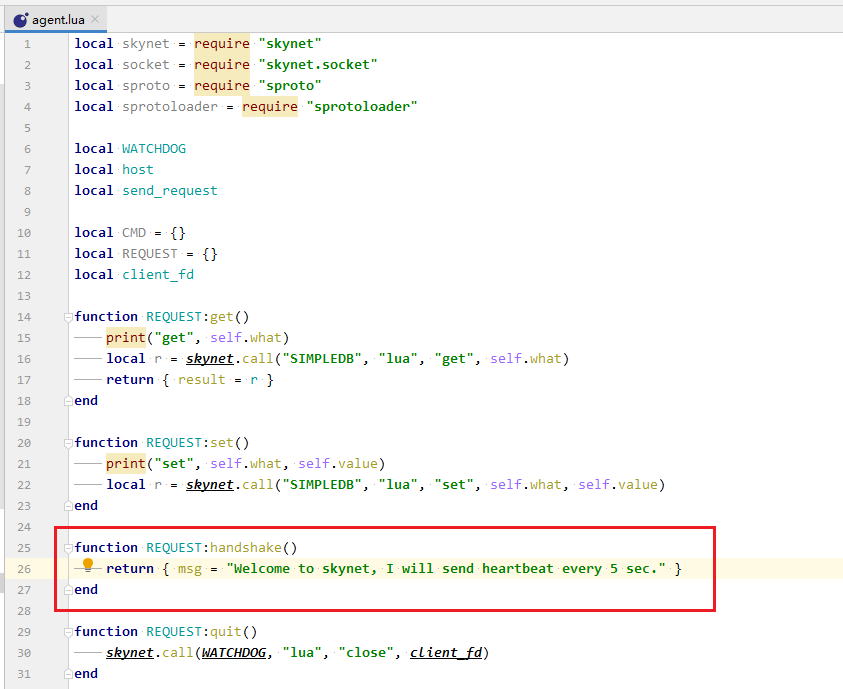
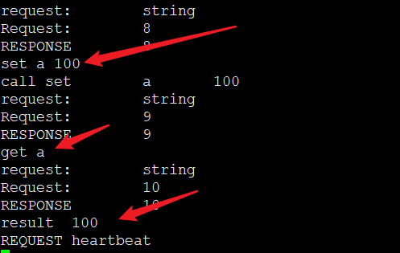
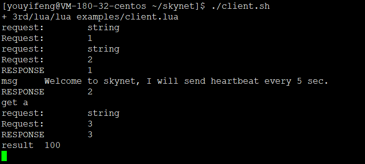
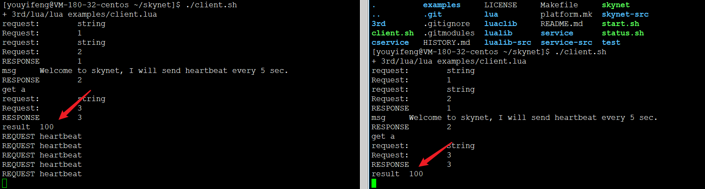
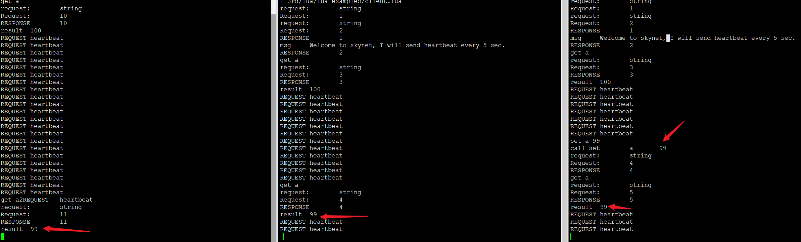

# helloworld

* 对初学者来说，不要管博客那么多屁话，先玩起来
* 越是复杂的东西，说到底其实越简单。是的，我在骗你

## 运行服务端


```
./skynet examples/config
```





## 运行客户端

* 这客户端跑起来该有什么效果呢？搞不懂大佬写博客完全不考虑菜鸡感受，没关系，我去猜
* 这玩意就是，你在客户端输入一个hello，会返回一个world

```
./3rd/lua/lua examples/client.lua
```




## 源码粗糙的分析一下hello world怎么来的

先看客户端：



粗看源码中的设定，只要输入hello，就会返回world。
那么send_request到底发生了什么骚操作？


```
local function send_request(name, args)
	session = session + 1
	local str = request(name, args, session)
	send_package(fd, str)
	print("Request:", session)
end
```

其中fd是 ```local fd = assert(socket.connect("127.0.0.1", 8888))```

因此send_request封装了send_package，调用套接字发送数据，str是request将请求封装后的'字符'，这里类似于protobuff。
这里其实是根据用户输入，发送相应的封装包，状态机写法，再来一个handshake，如下，则每次输入handshake就会收到一条```msg	Welcome to skynet, I will send heartbeat every 5 sec.```

```
send_request("handshake")
send_request("set", { what = "hello", value = "world" })
while true do
	dispatch_package()
	local cmd = socket.readstdin()
	if cmd then
		if cmd == "quit" then
			send_request("quit")
		elseif cmd == "handshake" then
			send_request("handshake")
		else
			send_request("get", { what = cmd })
		end
	else
		socket.usleep(100)
	end
end
```

然后服务端接收到消息怎么处理？




服务端监听8888端口

字符串定位法，握手包返回的字符串对应到



同理 REQUEST:set， REQUEST:get 也是这么调用的，调整一下代码。

```
while true do
	dispatch_package()
	local cmd = socket.readstdin()
	if cmd then
		res = Split(cmd," ")
		if res[1] == "quit" then
			send_request("quit")
		elseif res[1] == "handshake" then
			send_request("handshake")
		elseif res[1] == "set" then
			print("call set", res[2], res[3])
			send_request("set", { what = res[2], value = res[3] })
		else
			send_request("get", { what = res[2] })
		end
	else
		socket.usleep(100)
	end
end
```

原始代码其实就只设置了一个值， hello = world

```
send_request("handshake")
send_request("set", { what = "hello", value = "world" })
```

那么这个默认的client就只能玩这么几个命令
1. get hello ，服务端返回world
2. 输入quit，服务端关闭，客户端JJ
3. 其他一概输入都没对应返回

调整一下代码，如上面所述，其实就是增加了set功能。set需要两个参数，key和value
那么就需要字符串split，lua居然没有split函数，简直了，特别不方便，这么抠门的么。。

```
function Split(s, delimiter)
	result = {};
	for match in (s..delimiter):gmatch("(.-)"..delimiter) do
		table.insert(result, match);
	end
	return result;
end
```

菜鸡我网上找一个，能用就行
另外，还有注意一点，lua里table索引是从1开始，而不是以往一概0开始做法。这个有点骚，不顾大众习惯，也是简直了。
总之，上述代码就是对用户输入进行解析，数据获取阶段的一些处理。



如此set a = 100 ,get a 返回100



多开几个客户端，返回都是100，好不好玩



其中任意一个客户端修改了a的值，其他的都会变，这相当于什么？思考一下，这是不是整个服务的一个全局变量



菜鸡品helloworld，感觉这特么其实就是一个全局变量CRUD的玩意儿，那么这个全局变量在哪里？master？

如果非要冠以游戏服务框架，那么其实亿万人的游戏，其实根本就是要解决高并发，为什么要高？亿万人同时修改一个数据，一台服务器能扛得住？一百台行不行？一万台呢？

总归到底，打破砂锅了，摊牌了，其实就是要尽可能高效的优雅的温柔的实现数据的CRUD，游戏无非就是交互的比较多而已，相比网页，游戏交互更多，套用一些服务器框架的几代发展，其实就是要解决一个数据CRUD的问题。

那么skynet跟RPC什么关系？难道。。。RPC不就是skynet中的callback？

菜鸡我目前只能品到这个阶段。必然会有大佬想跟我杠，惹不起惹不起。。我继续品


---
