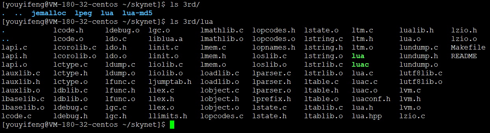
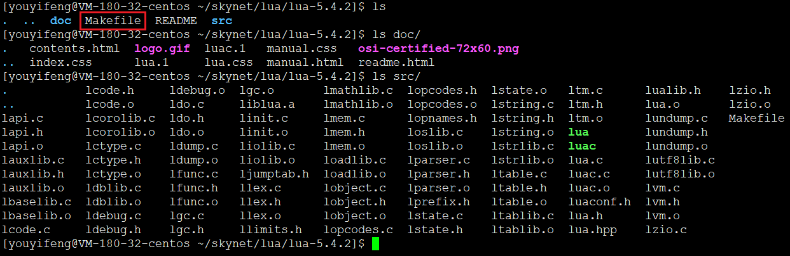

# 源码获取及编译

只考虑Linux平台

```
git clone https://github.com/cloudwu/skynet.git
cd skynet
make  linux
```

注意：

1. 当前skynet强依赖lua 5.4，好在lua本身比较小。因此都包含在3rd/lua目录下。不过对比完整的lua，少了顶层Makefile，意味着无法```make install```，这个三方库不够纯正啊，莫非有什么改动？？





2. 有个submodule，在3rd/jemalloc目录。```make linux```会去clone
