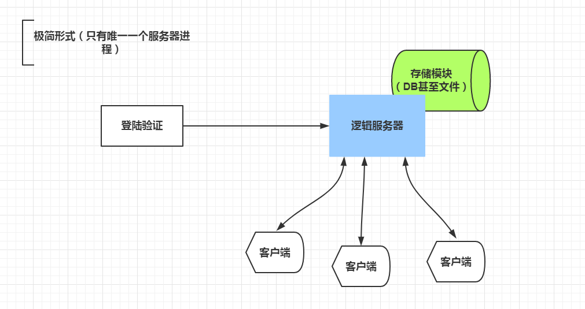
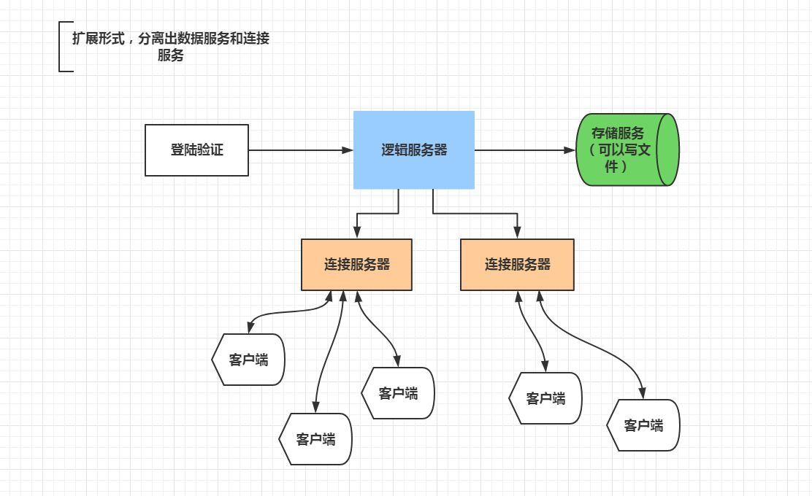
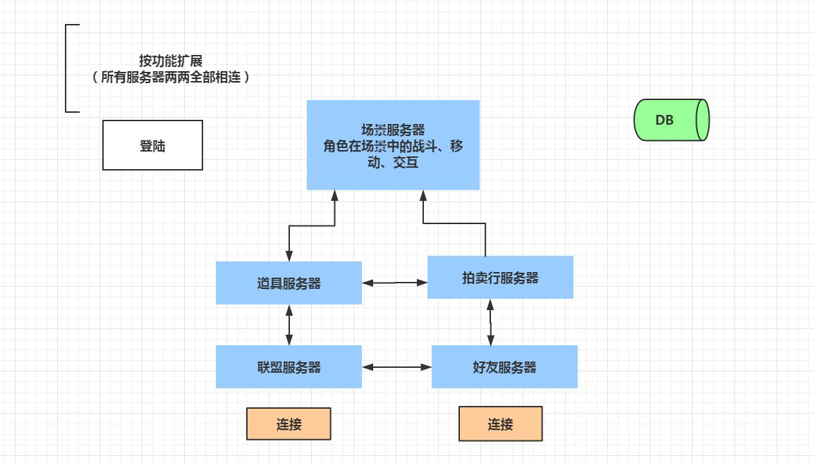
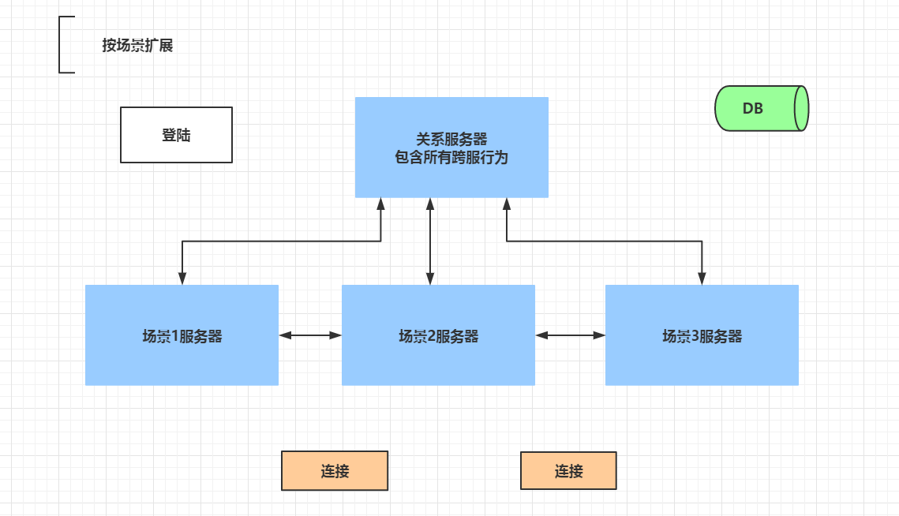
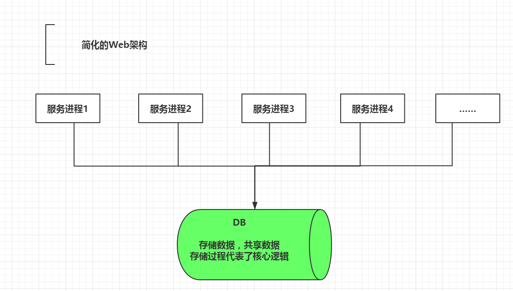

# 游戏服务器架构通识

* 摘抄自: <https://zhuanlan.zhihu.com/p/28447002>

从游戏服务器发展的简单历程出发，鸟瞰一下目前大多数的游戏服务器架构。解释清楚游戏服务器是在解决什么问题，痛点到底在哪里。

## 早期网游服务器

蛮荒时期的游戏服务器框架我们一笔带过，那时的游戏服务器和一个小Web服务没有区别。

蛮荒时代的服务器只负责存储玩家账号、数据、转发场景内其他玩家的行为。很多移动、使用技能等关键逻辑在服务器上根本没有。随意就能用**变速齿轮**改变游戏速度。

从《传奇》的时代开始，游戏服务器就不再是简单的上传存档、下载存档、访问页面而已。游戏服务器内部出现了游戏逻辑，既能用于同步每个玩家看到的世界，又能让逻辑与客户端分离，避免早期的网络游戏那种毫无防范的逻辑体系（早期对外挂防御能力为0）。

如图，客户端通过某种形式验证登陆以后，就和服务器通过TCP直接相连了。这种服务器的承载能力不高，但那时在游戏逻辑上也务求简化，把负载减少到极致。

例如：1、玩家看不到怪物的血量，或者只能看到正在打的怪物的血量。2、地图有格子的概念，每个格子只能有一个单位，极大限制了同屏人数。

由于逻辑尽量简化，虽然这时的服务器逻辑服务都是**单进程单线程**的，但是也足够表现交互的感受。

这种架构奇怪的地方是处理网络连接数据传输的压力和逻辑处理的压力在同一个服务器上（存储模块可能也在同一个进程），就算逻辑处理压力为0，承载人数也高不到哪去。

虽然这时的游戏服务器设计很简陋，但是网游第一次给了玩家真实世界的感受。单服人数不足的问题可以靠开多组服务器实现，所以曾经出现了几百上千组服务器的辉煌时代。

## 早期游戏服务器的改进版本

当开发者们有了初步经验以后，新作品的开发，自然而然的过渡到了如下的形式：

游戏逻辑服务依然是在一台服务器上，单进程（逻辑处理本身肯定是在一个线程中，可以有子线程负责内网通信）。但是我们自然的想到，存储负载和网络连接负载可以从逻辑服上拆出来。

连接服务器负责把客户端和服务器之间的消息转化为服务器之间的消息，可以顺便做一些加解密的工作。

这一点小改动极大提高了单服连接人数的上限。但是玩家要求提高了，空出来的性能很快被丰富的游戏系统吃掉了。

由于连接服务器本身没有时序性，很容易做分布式的（其实大部分游戏还是只用一个连接服），存储服务不要求高实时性，高峰期存盘间隔可以稍长一些，不会对游戏服造成影响。

## 成熟形态的服务器框架

逻辑服务器的负载均摊方法一：**按照功能划分多个服务器进程**

逻辑服务器的负载均摊方法二：**按照场景划分多个服务器进程**

对游戏服务器历史有了基本了解后，成熟形态的游戏服务器很容易理解。简单来说，就是把逻辑服务器单个进程的压力分摊到多个服务器。

难点在逻辑的设计上，要像做手术一样把本来是一体的功能切开，并抽象出若干个API来保持联系（服务器之间是TCP连接）。

在分解时，要**找联系相对最薄弱的环节入手**，比如场景和场景之间分开、单独抽出聊天服务、组队服务、好友服务。

无论如何分解，最终结果只能是有限个服务。而且分解的越细，开发难度就越大。因为跨服务器逻辑是把简单的同步逻辑变成了异步Callback逻辑（RPC远程过程调用），而且容易出现时序问题等不易测试的问题。

单个场景服务几乎是无法分解的。分解单个场景难度巨大以至于出现了BigWorld引擎来专门解决场景分割问题，后面会谈到。

这种成熟形态的游戏服务器已经能满足现实中99%的频繁交互类网游需求，是大型MMO端游、页游的主流形式。

当然有实力的公司在这个基础上会做很多改动，实现动态开辟副本、相位技术等等，但是万变不离其宗，其本质和上图没有什么区别。

## 开房间式的网络游戏

开房间式的网络游戏也是游戏的一个重要分支，英雄联盟、DOTA、很多手游例如皇室战争、王者荣耀等等。

这种游戏房间之间几乎没有交互，只有大厅内有交互，可以理解为原始形态的游戏服务器的平行扩展。

房间式游戏扩展难度较小，只是需要根据玩家数量动态扩展游戏房间的数量、服务器数量。很像网站的架构。

这种游戏架构最最适合放在云平台上，设计合理的话，它可能遇到的问题和大型网站几乎一模一样。不需要特别的讨论它们。

只是，毕竟游戏不都是开房间的玩法。

## 小结：游戏服务器框架特点

1、真正的数据都在内存中，数据库性能不那么重要

· 注：很多大型游戏采用了共享内存，避免宕机时损失过大。

2、单CPU性能比CPU数量重要的多。

3、目前有很多游戏，特别是手游，使用Redis读写代替内存读写，甚至也有用Mongo的。

4、开新服、旧区合服的情况，非常适合云平台。

## 先进服务器框架

### BigWorld

BigWorld引擎的代表作：

· 中国：《天下贰 》《天下叁》等等数十款，网易对BigWorld的实用化贡献很大。

· 国际：《魔兽世界》早期版本，《坦克世界》，《战争雷霆》

BigWorld的核心理念，要回到上面讲过的场景分割问题。

BigWorld利用平面切分的原理，将场景划分为小块，不同的块可以运行在不同的服务器上。而且块的划分是动态的，根据玩家密集程度、数量动态调整块的大小。。

具体技术上，使用了Actor模型，要求每个对象都是独立的Entity，对象之间只能通过消息协作，严格限制对象之间的直接交互。

后来随着手游的崛起、端游的衰落、网游玩法向多元化发展，这一系列的变化，导致BigWorld引擎很快就衰落了。

BigWorld引擎从曾经的大红大紫，到现在的无人问津，反映出游戏服务器技术的发展趋势。BigWorld的强制Actor模型，实际上是牺牲了开发效率，换取了服务器可扩展性。

理论上单服承载人数可以达到百万级别。但是游戏的业务逻辑的修改很频繁，开发效率低下是游戏设计师不能承受之重。

这种架构天生就是为云计算准备的，而且单个物理机承载量十分有限，每个游戏大区都需要大量实体机。

如果BigWorld成功…… 可惜的是，它和实际市场的发展趋势背道而驰了。

游戏开发相比电商系统，项目规模小几个数量级，但是相对的，迭代速度要快几倍。项目之间如果类型不同或是玩法有差异，能复用的代码并不多。

聊聊十万行代码。游戏服务器开发速度受美术资源制作速度、客户端开发速度制约。近几年我猜测服务器方面并不会有大的技术革新。

游戏开发未来的趋势是多元化、低门槛化、大众化。很长一段时间内BigWorld这种大怪兽级别的引擎不会再崛起。

分布式框架的崛起时间点，无论如何，也在VR技术成熟之后了。

### Skynet

Skynet是新兴的一种通用型服务器框架（完全开源），它游走在传统不易分布服务器和分布式服务器之间。

它是一种泛用型框架，不仅能很好的作为游戏服务器框架使用，而且用来搭建HTTP服务也具有惊人的性能（几百行代码的简单HTTP实现，能达到nginx 60%的性能）。

矛盾的是，由于它对脚本虚拟机做了一些重要的Hack，导致它完全绑定在了Lua这一种语言上。

Skynet原理阐述：

把服务抽象为微服务，一个系统内可以建立成千上万个微服务，Skynet调度m个线程（m=CPU核心数）、处理n个微服务各自的事件。

由于n个微服务在同一个进程内，可以达到0延迟的内部通信（极端情况下无拷贝）

同时Lua虚拟机又提供了沙盒机制，微服务之间的Lua逻辑代码不会有任何干扰，必要的时候又可以在C语言层面、Lua沙盒之外共享数据。

由于服务本身有良好的隔离性，可以较为方便的把服务部署到多物理机上（考虑到性能问题，不能像BigWorld那样任意部署）。

Skynet这种架构已经在Lua体系的游戏公司内大量使用（以网易系为代表），悄无声息的渗透到其他公司里。（和Lua语言当年的情况有点像，是金子总会发光的。）

### 以Go语言为主的其他框架

Go语言的goroutine特性，给游戏开发者带来巨大的想象空间。

在Go语言的基础上，很容易出现更好的房间式游戏框架、类似Skynet的框架、改进型的传统框架。

但是可以大胆预测，最终实现的效果不会超过erlang、skynet这类框架的范围。这是因为游戏业务本身的特性决定的。

## 结束语

探讨了十几二十年来，主流服务器框架的发展脉络，以MMO-RPG这种最具代表性的网游类型为主（同时MMO对服务器架构的挑战也是最大的），兼谈到一些其他类型的游戏。由于游戏类型多种多样，各个国家和地区的开发商所偏好的架构方式也大有不同，文中难免挂一漏万，但不太影响整体脉络，也不影响对网游服务器的核心问题的总结——逻辑拆分。
