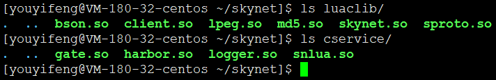

# 源码目录结构


* 3rd 第三方的代码，有 lpeg、lua、lua-md5、jemalloc，大佬有所改动，非官方源码
* HISTORY.md 明明是Changelog.md，您这命名不符合规范
* LICENSE 许可证信息，采用 MIT，很宽松的协议
* examples 附带的例子
* lualib 使用 lua 写的库
* lualib-src 使用 C 写并封装给 lua 使用的库
* Makefile 编译规则文件
* platform.mk 编译与平台相关的设置，Makefile中引用
* README.md 简单介绍了怎么编译和测试 Skynet
* service 使用 lua 写的 Skynet 的服务模块
* service-src 使用 C 写的 Skynet 的服务模块
* skynet-src Skynet 的核心代码
* test 使用 lua 写的一些测试代码

其实搞不懂大佬的命名为什么非要这么像。。

什么service，service-src，可否做个正常人，命名见名知意~

可见大佬写代码从来不讲规矩，C语言第一课变量的命名方式，见名知意，极少有人能够掌握精髓。
尤其该匹配的都是大佬，随意命名法，跑通就行，能跑起来就是爸爸，你服不服~~

经过编译之后的目录
```
3rd
**cservice** -d
examples
HISTORY.md
LICENSE
**luaclib** -d
lualib
lualib-src
Makefile
platform.mk
README.md
service
service-src
**skynet** -f
skynet-src
test
```

多了两个目录，一个文件



不信你make clean一下，其实就是删除这些so库

```
[youyifeng@VM-180-32-centos ~/skynet]$ make clean
rm -f ./skynet cservice/*.so luaclib/*.so
```

另外需要吐槽一下，同样是so库，分成两个什么意思？
大致猜测一下，一个是给C核心调用的，一个是C库给lua调用的。这看起来很OK


----
